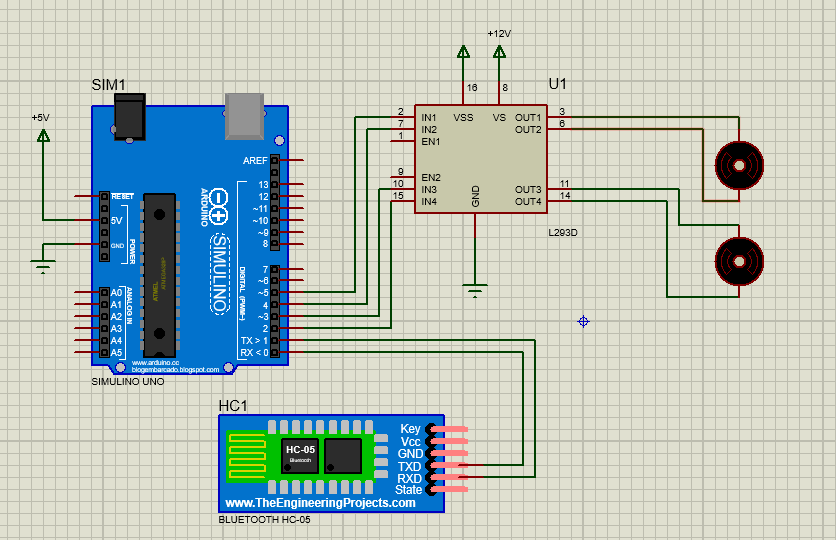
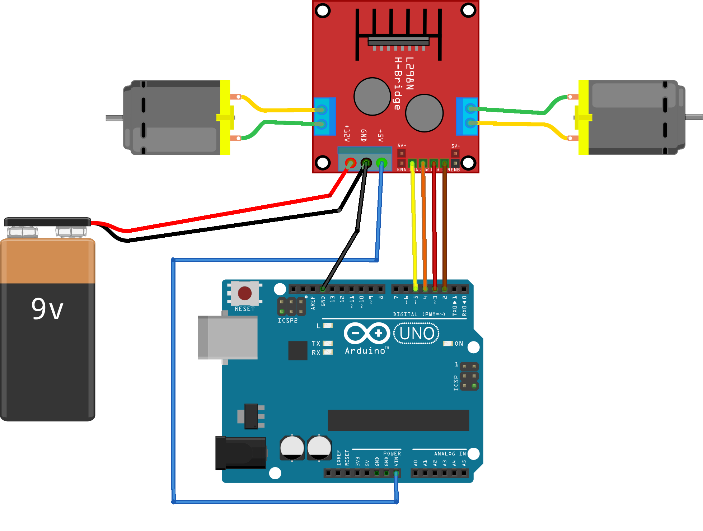
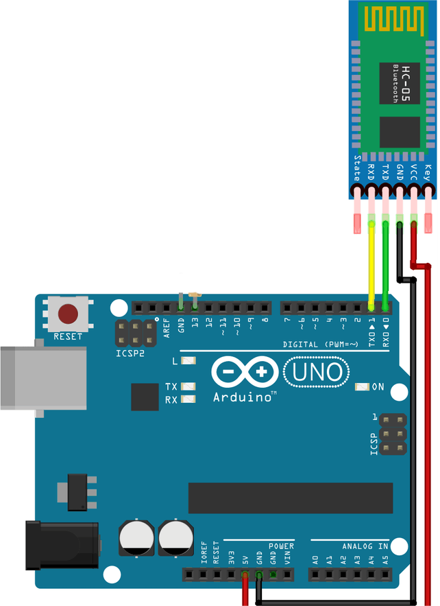

# Project Overview

## Bluetooth-Controlled Robotic Vehicle

This project is a small Arduino-based robotic vehicle controlled remotely through a Bluetooth connection.

It was developed as an undergraduate engineering project and served as a practical exercise in embedded programming, serial communication, motor control, circuit design, and simulation.

The vehicle combines an Arduino Uno, a motor driver, DC motors, and an HC-05 Bluetooth module. A mobile application is used to send movement commands to the vehicle.

## Physical Prototype

The project was implemented as a small two-wheel robotic vehicle.

The Arduino acts as the main controller. Commands received through the Bluetooth module are interpreted by the firmware and translated into motor control signals through the motor driver.

## Circuit Simulation

The circuit was also reproduced and tested in Proteus to simulate the interaction between the Arduino, Bluetooth module, motor driver, and motors.

The simulation provided a way to verify the basic circuit and control logic before or alongside the physical implementation.

## Hardware Wiring

The main hardware connections can be divided into two parts: the motor-control circuitry and the Bluetooth communication interface.

### Arduino and Motor Driver

The Arduino provides the control signals used by the motor driver to operate the vehicle's motors.

The motor driver handles the electrical control of the DC motors while the Arduino determines their direction according to the received commands.

### Arduino and Bluetooth Module

The HC-05 Bluetooth module provides the wireless serial communication link between the mobile controller and the Arduino.

The Bluetooth module communicates with the Arduino through its serial interface, allowing movement commands to be transmitted wirelessly.

## Mobile Control

A mobile application was used as the remote controller for the vehicle.

The application sends simple movement commands through the Bluetooth connection. The Arduino firmware then interprets these commands and controls the motors accordingly.

The basic command set used by the project is:

| Command | Action |
|:---:|---|
| `F` | Forward |
| `B` | Reverse |
| `L` | Left |
| `R` | Right |
| `S` | Stop |

## Firmware

The original firmware is provided in the [`firmware`](../firmware/) directory.

The program is a simple Arduino sketch responsible for:

- Receiving commands through the Bluetooth serial connection.
- Interpreting the received movement commands.
- Controlling the motor driver outputs.
- Stopping the motors when a stop command is received.

The firmware is kept close to its original form as part of the project's historical record.

## Project Context

This project was developed as an educational implementation of a Bluetooth-controlled robotic vehicle.

It brought together several basic embedded-systems concepts in a single practical project:

- Arduino programming
- Serial communication
- Bluetooth communication
- DC motor control
- Motor-driver interfacing
- Circuit simulation with Proteus
- Hardware and software integration

The project was based on established educational robotics designs and was intended primarily as a practical learning exercise rather than as a novel robotics platform.

## Summary

The complete system can therefore be viewed as a simple chain:

**Mobile Application → Bluetooth → Arduino → Motor Driver → DC Motors**

The combination of the physical prototype, circuit schematics, Proteus simulation, mobile controller, and Arduino firmware provides a concise record of the project and its implementation.
